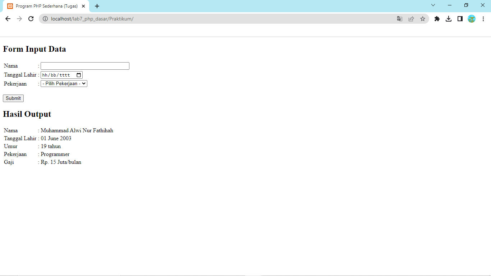

# Tugas Pemrograman Web 2 (Praktikum 2)
## Profil
| #               | Biodata                      |
| --------------- | ---------------------------- |
| **Nama**        | Muhammad Alwi Nur Fathihah   |
| **NIM**         | 312110388                    |
| **Kelas**       | TI.21.A.1                    |
| **Mata Kuliah** | Pemrograman Web 2            |

# Persiapan
Untuk memulai membuat kode php, perlu disiapkan web server dan interpreter PHP terlebih dahulu. Web server yang kita gunakan adalah Apache2 dan interpreter PHP. Untuk memudahkan proses praktikum, kita gunakan aplikasi bundle web server yaitu XAMPP.

## Install XAMPP
1. Unduh XAMPP [Disini](https://www.apachefriends.org/download.html) dan sesuaikan dengan sistem operasi kalian, lalu pilih versi php. lalu klik Download.
2. Kemudian buka installer XAMPP nya, setelah itu next - next saja hingga selesai.
3. Secara default XAMPP itu akan disimpan dalam Local Disk (C:)


4. Buka XAMPP Control Panel.
5. Lalu klik Start pada Apache dan MySQL.


6. Kemudian uji coba apakah web server sudah bekerja dengan baik dengan mengetik http://127.0.0.1 atau http://localhost

## Memulai PHP
<p>Buat folder `lab7_php_dasar` pada root direktori web server (C:\xampp\htdocs)
<p>Kemudian untuk mengakses direktori tersebut pada web server dengan mengakses URL: http://localhost/lab7_php_dasar/


## PHP Dasar
<p>Buat file baru dengan nama php_dasar.php pada directory tersebut. Kemudian buat kode seperti berikut.

```html
<!DOCTYPE html>
<html lang="en">
<head>
  <meta charset="UTF-8">
  <meta http-equiv="X-UA-Compatible" content="IE=edge">
  <meta name="viewport" content="width=device-width, initial-scale=1.0">
  <title>PHP DASAR</title>
</head>
<body>
  <h1>Belajar PHP Dasar</h1> 
  <?php
  echo "Hello World!";
  ?>
</body>
</html>
```

<p>Kemudian untuk mengakses hasilnya melalui URL: http://http://localhost/lab7_php_dasar/php_dasar.php


## Variable PHP
<p>Menambahkan variable pada program.

```html
<h2>Menggunakan Variable</h2>
<?php
  $nim = "312110388";
  $nama = 'Muhammad Alwi Nur Fathihah';
  echo "NIM : " . $nim . "<br>";
  echo "Nama : $nama";
?>
```


## Predefine Variable $_GET
<p>Buat file `latihan2.php` dalam direktori lab7_php_dasar. lalu masukan kode berikut.

```html
<h2>Predefine Variable $_GET</h2>

<?php
echo "Selamat Datang " . $_GET['nama'];
?>
```

<p>Untuk mengaksesnya gunakan URL: http://http://localhost/lab7_php_dasar/latihan2.php?nama=Alwi


## Membuat Form Input
- Buat file `latihan3.php` di dalam direktori lab7_php_dasar, Kemudian tambahkan kode berikut.

```html
<!DOCTYPE html>
<html lang="en">
<head>
    <meta charset="UTF-8">
    <title>PHP Dasar</title>
</head>
<body>
<h2>Form Input</h2>
<form method="post">
    <label>Nama: </label>
    <input type="text" name="nama">
    <input type="submit" value="Kirim">
</form>
<?php
echo 'Selamat Datang ' . $_POST['nama'];
?>
</body>
</html>
```

- Lalu inputkan sesuatu dalam kolom form tersebut, kemudian klik Kirim.
- Maka, hasilnya akan seperti berikut:


## Operator
- Masukan kode berikut.

```html
$gaji = 1000000;
$pajak = 0.1;
$thp = $gaji - ($gaji*$pajak);
echo "Gaji sebelum pajak = Rp. $gaji <br>";
echo "Gaji yang dibawa pulang = Rp. $thp";
```

- Maka, hasilnya akan seperti berikut.


## Kondisi IF
- Masukan kode berikut.

```html
$nama_hari = date("l");
if ($nama_hari == "Sunday") {
echo "Minggu";
} elseif ($nama_hari == "Monday") {
echo "Senin";
} else {
echo "Selasa";
}
```

- Maka, hasilnya akan seperti berikut.


## Kondisi Switch
- Masukan kode berikut.

```html
$nama_hari = date("l");
switch ($nama_hari) {
  case "Sunday":
    echo "Minggu";
    break;
  case "Monday":
    echo "Senin";
    break;
  case "Tuesday":
    echo "Selasa";
    break;
  default:
echo "Sabtu";
}
```

- Maka, hasilnya akan seperti berikut.


## Perulangan FOR
- Masukan kode berikut.

```html
echo "Perulangan 1 sampai 10 <br />";
for ($i=1; $i<=10; $i++) {
echo "Perulangan ke: " . $i . '<br />';
}
echo "Perulangan Menurun dari 10 ke 1 <br />";
for ($i=10; $i>=1; $i--) {
echo "Perulangan ke: " . $i . '<br />';
}
```

- Maka, hasilnya akan seperti berikut.


## Perulangan While
- Masukan kode berikut.

```html
echo "Perulangan 1 sampai 10 <br />";
$i=1;
while ($i<=10) {
echo "Perulangan ke: " . $i . '<br />';
$i++;
}
```

- Maka, hasilnya akan seperti berikut.


## Perulangan Do While
- Masukan kode berikut.

```html
echo "Perulangan 1 sampai 10 <br />";
$i=1;
do {
echo "Perulangan ke: " . $i . '<br />';
$i++;
} while ($i<=10);
```

- Maka, hasilnya sama saja dengan perulangan sebelumnya.

# Pertanyaan dan Tugas
<p>Buatlah program PHP sederhana dengan menggunakan form input yang menampilkan nama, tanggal lahir dan pekerjaan. Kemudian tampilkan outputnya dengan menghitung umur berdasarkan inputan tanggal lahir. Dan pilihan pekerjaan dengan gaji yang berbeda-beda sesuai pilihan pekerjaan.

## Praktikum
- Buat file `Index.php` dalam direktori Praktikum agar terlihat rapih
- Masukan kode berikut.

```html
<!DOCTYPE html>
<html lang="en">
<head>
    <title>Program PHP Sederhana (Tugas)</title>
</head>
<body>
    <h2>Form Input Data</h2>
    <form action="" method="post" name="form1">
        <table>
            <tr>
                <td>Nama</td>
                <td>:</td>
                <td><input type="text" name="nama" size="30"></td>
            </tr>
            <tr>
                <td>Tanggal Lahir</td>
                <td>:</td>
                <td><input type="date" name="tgl_lahir" size="30"></td>
            </tr>
            <tr>
                <td>Pekerjaan</td>
                <td>:</td>
                <td>
                <select id="pekerjaan" name="pekerjaan" required>
                    <option value="">- Pilih Pekerjaan -</option>
                    <option value="Programmer">Programmer</option>
                    <option value="UI/UX Designer">UI/UX Designer</option>
                    <option value="Atlit">Atlit</option>
                    <option value="Penyanyi">Penyanyi</option>
                </select>
                </td>
            </tr>
        </table>
        <br>
        <button type="submit" name="submit">Submit</button>
        <br>
    </form>
    <?php
    if (isset($_POST['submit'])) {
        $nama = $_POST['nama'];
        $tgl_lahir = $_POST['tgl_lahir'];
        $tanggal = date('d', strtotime($tgl_lahir));
        $bulan_teks = date('F', strtotime($tgl_lahir));
        $tahun = date('Y', strtotime($tgl_lahir));
        $hasil_tanggal_lahir = $tanggal . ' ' . $bulan_teks . ' ' . $tahun;

        $pekerjaan = $_POST['pekerjaan'];

        // Umur
        $today = new DateTime();
        $dob = new DateTime($tgl_lahir);
        $umur = $today->diff($dob)->y;
        
        // Pekerjaan dan gaji
        switch ($pekerjaan) {
            case 'Programmer':
                $gaji = "15 Juta";
                break;
            case 'UI/UX Designer':
                $gaji = "20 Juta";
                break;
            case 'Atlit':
                $gaji = "2 Milyar";
                break;
            case 'Penyanyi':
                $gaji = "100 Juta";
                break;
            default:
                $gaji = "-";
                break;
        }


    // Tampilkan hasil
    echo "<h2>Hasil Output</h2>";
    echo "<table>";
    echo "<tr><td>Nama</td><td>:</td><td>$nama</td></tr>";
    echo "<tr><td>Tanggal Lahir</td><td>:</td><td>$hasil_tanggal_lahir</td></tr>";
    echo "<tr><td>Umur</td><td>:</td><td>$umur tahun</td></tr>";
    echo "<tr><td>Pekerjaan</td><td>:</td><td>$pekerjaan</td></tr>";
    echo "<tr><td>Gaji</td><td>:</td><td>Rp. $gaji/bulan</td></tr>";
    echo "</table>";

}
    ?>
</body>
</html>
```

- Maka, hasilnya akan seperti berikut.


- Sesudah diinputkan.



# Terima Kasih!